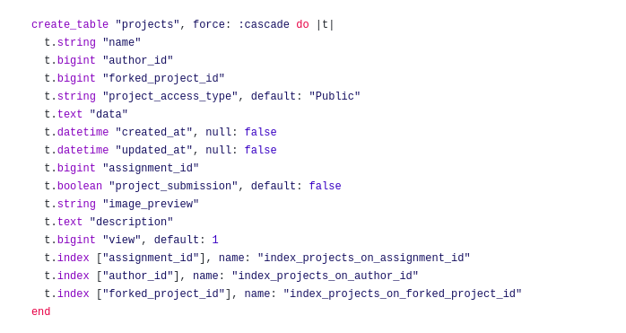

# Sample API for CircuitVerse GSOC Project Proposal

There are currently only two routes working with only get functions available throughout the API.

The structure for the project entity is taken from the circuit verse repo ruby definition which defines the project as 



The routes are as follows.

1. /api/v0/projects
   
   This will return a list of ten projects found in the csv sheet. To further customize and get results of next 10 projects you can add a _?start=30_ to get 10 projects starting from project_id 30. Every result contains two main parts.

    ```
    {
       "query":"success || failed",
       "data":[
            {
                "id":"1",
                ...,
            },
            .... // all of the listings
            {
                "id":"10",
                ...
            }
       ]
   }
   ```

1. /api/v0/projects/:id

    This is used to query a certain project and it will return the project of the certain id.

    The json format for the result is supposed to be like this.

    ```
    {
       "query":"success || failed",
       "data":{
            "id":"1",
            ...,
        },
   }
   ```
